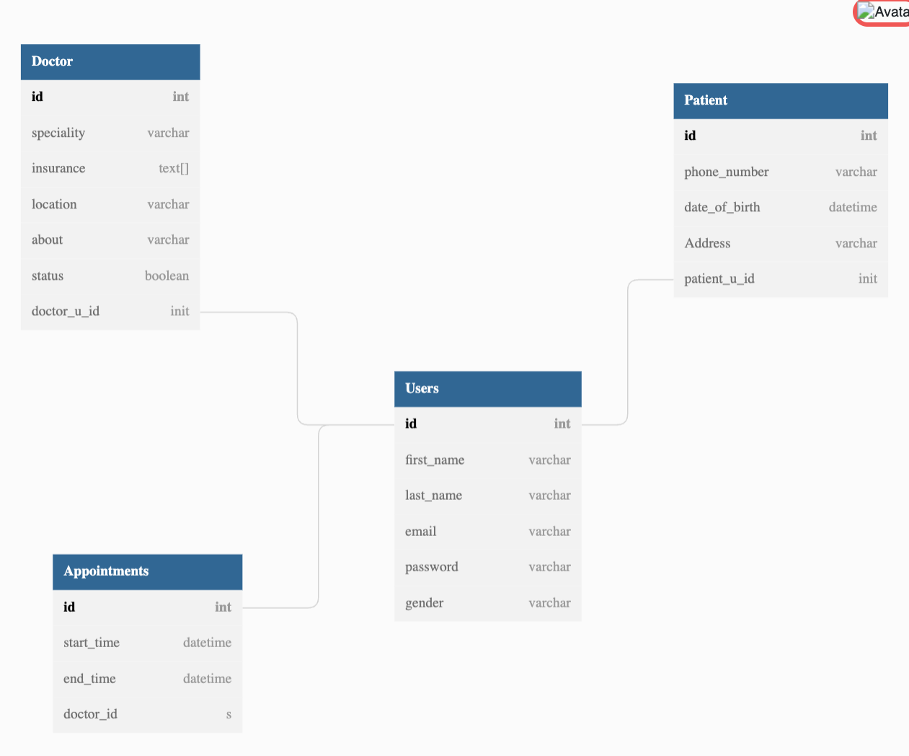

# Appointment Booking App

### Table of Contents

[About the Project](#about-the-project)  
[Features of this app](#features-of-this-app)  
[Technology used](#technology-used-1)  
[Database diagram](#database-diagram)  
[App Design/List of APIs](#app-design)  
[Wire framing](#wire-framing)

### About the Project

This is fullstack app. Planning to build using react, typescript, node and postgres

### Features of this app

This app has two users: Admin and Patients

**Admin User**

1. Admin can Add, Edit, Delete and view Doctor Data

2. Admin can login to the app(nice to have)

**Patient User**

1. Patient can view Doctor list
2. Patient can search Doctor
3. Patient can book appointment
4. Patient can add their profile details
5. Patient can get confirmation message via phone number(nice to have)

### Technology used

**Backend**

- nodejs
- express
- prisma
- postgres

**Frontend**

- React
- Typescript
- Chakra UI

### Database diagram

[dbdiagram](https://dbdiagram.io/d/62e41aeaf31da965e841437b)

### App Design

| Functionality             | Method | Path            |
| ------------------------- | ------ | --------------- |
| list of doctors           | GET    | /admin          |
| add new doctor            | POST   | /api/doctor     |
| update doctor info        | PUT    | /api/doctor/:id |
| View individual doctor    | GET    | /api/doctor/:id |
| Delete individual doctor  | DELETE | /api/doctor/:id |
| Doctor list(public- view) | GET    | /               |

### Wire framing

Please click [here](https://app.diagrams.net/#G1QRSWzpZixVfFF8Xm8DQCiyJ28nhHi1j6) to see wire-framing

## Resource referred

[pg-promose transaction](https://github.com/vitaly-t/pg-promise/wiki/Learn-by-Example#transactions)
[Developing a CRUD Node.js Application with PostgreSQL](https://glaucia86.medium.com/developing-a-crud-node-js-application-with-postgresql-d25febb1cc4)
[useMutation hook](https://www.carlrippon.com/update-requests-with-react-query/)
